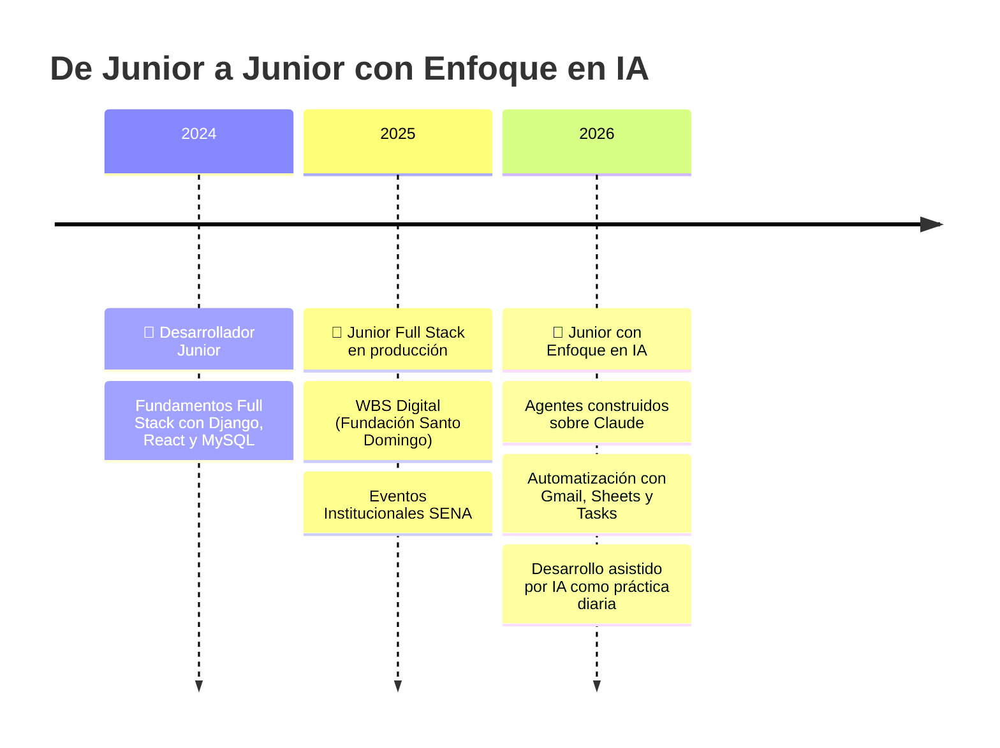

  

  

###

  
  
  
  

  

###

<h2 align="center">🧬 Mi evolución como developer</h2>

  
  
  
  
  

> 💚 **Mi filosofía:** la IA no reemplaza al desarrollador — potencia al que aprende a dirigirla. Por eso construyo cada producto usando agentes de IA como parte del flujo, sin perder el criterio técnico.

###

<h2 align="left">👨‍💻 Acerca de mí</h2>

Soy de Colombia 🇨🇴 — desarrollador junior full stack en evolución hacia un perfil <b>potenciado con IA</b>, uno de esos nuevos títulos que están surgiendo con esta era.  
- 🔭 Actualmente construyo productos institucionales y personales en producción. 
- 🤖 Integro <b>agentes de Claude</b> y automatización inteligente en mi flujo de trabajo diario. 
- 📚 Siempre aprendiendo: prompt engineering, orquestación de agentes y arquitectura de software. 
- ⚡ Y siempre con tiempo libre para nuevas ideas.

###

<h2 align="left">🚀 Productos desarrollados últimamente</h2>

| Producto | ¿Qué hace? | Stack | Estado |
| --- | --- | --- | --- |
| 💸 **Gestor de Finanzas Workspace** | Ecosistema de finanzas personales: lee recibos de Gmail, registra histórico en Google Sheets y proyecta pagos en Google Tasks desde un dashboard Angular | `Angular` `TypeScript` `Google APIs` | 🟢 Activo |
| 🤖 **Agentes IA con Claude** | Laboratorio de agentes que automatizan flujos de desarrollo: documentación, revisión y tareas repetitivas | `Claude` `Shell` `Prompt Engineering` | 🟢 Activo |
| 🎨 **Sistema de Diseño CCB** | Sistema de diseño institucional para la Cámara de Comercio de Barranquilla: componentes, tokens y patrones UI | `JavaScript` `Design System` | 🔒 Interno |
| 🏪 **Tu Mejor Proveedor** | Plataforma de gestión de proveedores con lógica de negocio en PL/pgSQL | `PostgreSQL` `PL/pgSQL` | 🟢 Activo |
| 🏗️ **WBS Digital** | Gestión técnica y documental del portafolio de proyectos sociales de Fundación Santo Domingo | `Angular` `Flask` `Azure` | 🚀 Producción |
| 📅 **Eventos Institucionales SENA** | Administración de eventos con notificaciones automáticas por Email y WhatsApp | `Django` `React` `MySQL` | 🔒 Interno |

###

<h2 align="left">🛠 Lenguajes y herramientas</h2>

<b>🤖 IA y automatización</b>

  
  
  
  

<b>💻 Stack principal</b>

  
  
  
  
  
  
  
  
  
  
  
  
  
  
  
  
  
  
  
  
  

<b>🗄️ Datos e infraestructura</b>

  
  
  
  
  
  
  
  
  
  
  
  
  
  
  
  
  
  
  
  
  
  
  

###

<h2 align="left">🔥 Mis estadísticas</h2>

  
  

  

  

###

<h2 align="center">🎧 Lo que suena mientras programo</h2>

  

###

  

