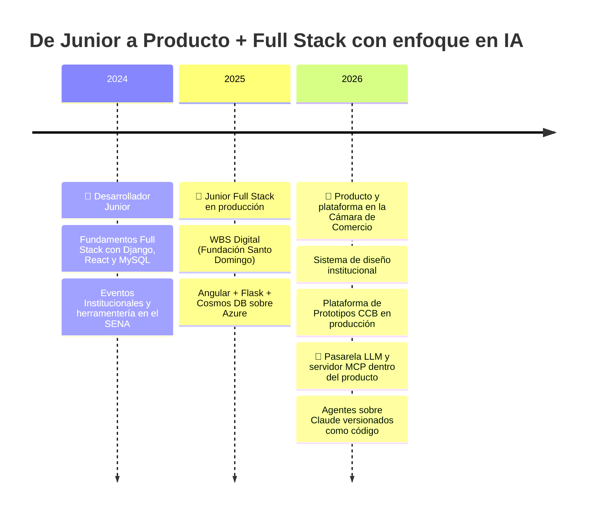

  

  

###

  
  
  
  

  

###

<h2 align="left">💼 Dónde estoy hoy</h2>

<table>
  <tr>
    <td width="190"><b>🏛️ Cámara de Comercio de Barranquilla</b> Mayo 2026 — Actualidad</td>
    <td>
      <b>Diseñador de Producto Digital y Desarrollador Full Stack</b> · Área de Desarrollo y Prospectiva  
      Llevo productos digitales de la idea al prototipo listo para producción: discovery, digitalización del proceso, integración de IA y construcción del MVP. La pieza central es el <b>punto de integración</b>: una plataforma donde cada producto del área vive como una aplicación más sobre <b>un despliegue, un login y una base de datos</b>, en vez de levantar infraestructura por proyecto.
    </td>
  </tr>
</table>

| | |
|---|---|
| 🚀 **En producción** desde julio de 2026 | 🗄️ **24 modelos** · 67 migraciones versionadas |
| 🔌 **83 operaciones** de API sobre 74 rutas | 🏢 **~67.500 empresas** en el directorio |
| ✅ **664 pruebas** de backend · 342 de frontend | 🤖 **14 herramientas MCP** con costo por llamada |

###

<h2 align="center">🧬 Mi evolución como developer</h2>

  
  
  
  
  

> 💚 **Mi filosofía:** la IA no reemplaza al desarrollador — potencia al que aprende a dirigirla. Por eso construyo cada producto usando agentes de IA como parte del flujo, sin perder el criterio técnico.

###

<h2 align="left">👨‍💻 Acerca de mí</h2>

Soy de Colombia 🇨🇴 — diseñador de producto digital y desarrollador full stack. Trabajo donde se cruzan las dos cosas: entender el problema del negocio y después construir el sistema que lo resuelve.  
- 🔭 Hoy construyo plataformas institucionales en producción y productos personales en paralelo. 
- 🤖 La capa de IA la construyo <b>dentro</b> del producto: pasarela LLM, servidor MCP propio y agentes sobre <b>Claude</b>. 
- 🧱 Me importan la arquitectura, la trazabilidad de los datos y que las cifras publicadas sean consultables. 
- 📚 Siempre aprendiendo: prompt engineering, orquestación de agentes y diseño de producto. 
- ⚡ Y siempre con tiempo libre para nuevas ideas.

###

<h2 align="left">🚀 Productos desarrollados últimamente</h2>

| Producto | ¿Qué hace? | Stack | Estado |
| --- | --- | --- | --- |
| 🏛️ **Plataforma de Prototipos CCB** | El punto de integración de los productos digitales de la Cámara: un despliegue, un login y una base de datos para todos los prototipos. Monolito modular Django, SPA React, capa de IA transversal y 6 tareas programadas de operación | `Django` `React` `PostgreSQL` `Docker` `Claude API` `MCP` | 🚀 Producción |
| 🏪 **Tu Mejor Proveedor** | Marketplace B2B sobre el directorio empresarial: proveedores verificados, hoja de vida de empresa en PDF y cotizaciones por correo, con reglas de negocio en PL/pgSQL | `Django` `React` `PostgreSQL` `PL/pgSQL` | 🚀 Producción |
| 🎨 **Sistema de Diseño CCB** | Sistema de diseño institucional construido desde el manual de identidad: tokens en CSS y JS, componentes React y motivos de marca en SVG | `React` `Design Tokens` `Tailwind CSS` | 🔒 Interno |
| 💸 **Gestor de Finanzas Workspace** | Ecosistema de finanzas personales: lee recibos de Gmail, registra histórico en Google Sheets y proyecta pagos en Google Tasks desde un dashboard Angular local-first | `Angular` `TypeScript` `Google APIs` | 🟢 Activo |
| 🤖 **Agentes IA con Claude** | Laboratorio donde versiono mis agentes de Claude Code como código: definiciones, specs y planes en git, enlazados al directorio operativo | `Claude` `Shell` `Prompt Engineering` | 🟢 Activo |
| 🏗️ **WBS Digital** | Gestión técnica y documental del portafolio de proyectos sociales de Fundación Santo Domingo | `Angular` `Flask` `Cosmos DB` `Azure` | 🚀 Producción |
| 📅 **Eventos Institucionales SENA** | Administración de eventos con notificaciones automáticas por Email y WhatsApp | `Django REST` `React` `MySQL` | 🔒 Interno |

###

<h2 align="left">🛠 Lenguajes y herramientas</h2>

<b>🤖 IA y automatización</b>

  
  
  
  
  

<b>💻 Stack principal</b>

  
  
  
  
  
  
  
  
  
  
  
  
  
  
  
  
  
  
  
  
  

<b>🗄️ Datos e infraestructura</b>

  
  
  
  
  
  
  
  
  
  
  
  
  
  
  
  
  
  
  
  
  
  
  

###

<h2 align="left">🔥 Mis estadísticas</h2>

  
  

  

  

###

<h2 align="center">🎧 Lo que suena mientras programo</h2>

  

###

  

